# Execution Flows

This document walks through the major execution flows in `AssetRegistry` and `Asset`, including the off-chain signatures required before on-chain calls.

---

## Table of Contents

1. [Actors & Concepts](#actors--concepts)
2. [createAsset](#createasset)
3. [subscribe](#subscribe)
   - [New Subscription](#new-subscription)
   - [Extend Existing Subscription](#extend-existing-subscription)
   - [Renew Subscription (New Nonce)](#renew-subscription-new-nonce)
4. [cancelSubscription](#cancelsubscription)
5. [revokeSubscription](#revokesubscription)
6. [unrevokeSubscription](#unrevokesubscription)
7. [claimCreatorFee (single subscriber)](#claimcreatorfeesingle-subscriber)
8. [claimCreatorFee (batch)](#claimcreatorfeebatch)
9. [claimRegistryFee](#claimregistryfee)

---

## Actors & Concepts

| Actor | Description |
|---|---|
| **Registry Owner** | Deployer/admin of `AssetRegistry`; can create assets and claim registry fees |
| **Creator** | Owner of a specific `Asset` contract; receives the creator share of subscription revenue |
| **Payer** | EOA whose ERC20 tokens fund a subscription |
| **Subscriber** | Off-chain identity represented as `keccak256(abi.encode(subscriberId, subscriberAddress))` |
| **AssetRegistry** | Central registry that deploys `Asset` contracts and routes calls |
| **Asset** | Per-creator contract that holds subscriptions and accrued fees |
| **ERC20 (Permit)** | Payment token that supports EIP-2612 `permit` (gasless approval) |

**Subscriber ID derivation:**
```
subscriberBytes32 = keccak256(abi.encode(subscriberIdString, subscriberAddress))
```
This ties an off-chain identity string to a specific Ethereum address.

**Fee split:** every subscription payment is split between Registry Owner and Creator:
```
registryShare = value × registryFeeShare / 100
creatorShare = value - registryShare
```
The split percentage is snapshotted into each `Subscription` record at subscribe time.

---

## createAsset

The Registry Owner registers a new creator asset. The call deploys a fresh `Asset` contract and records its address in the registry.

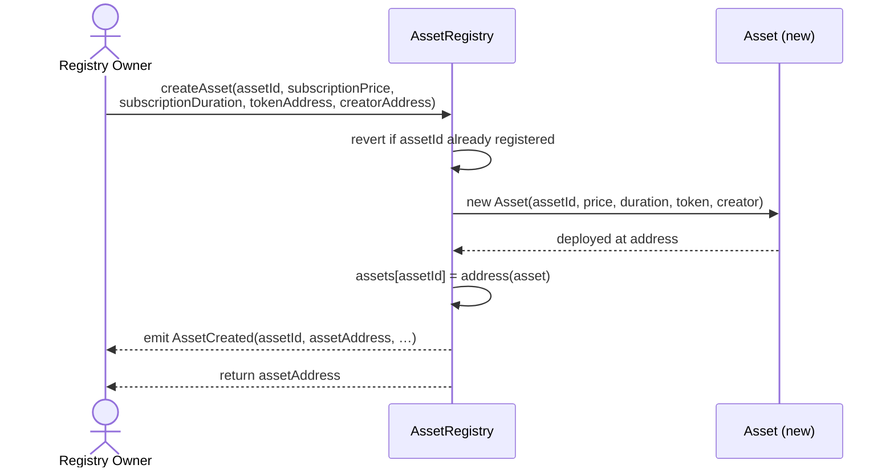

**Key validations in `Asset` constructor:**
- `_owner != address(0)` — creator address must be set
- `_tokenAddress != address(0)` — payment token must be set
- `_subscriptionDuration > 0` — period length must be non-zero
- `msg.sender` (the registry) is stored as `REGISTRY_ADDRESS` — only the registry can call `onlyRegistry` functions

---

## subscribe

Subscribing always requires an **off-chain EIP-2612 permit signature** from the payer. This lets the `Asset` contract pull payment tokens without a prior on-chain `approve` transaction.

### Off-chain permit signature (required before every subscribe call)

The payer signs an EIP-2612 permit off-chain:

```
domain:  { name, version, chainId, verifyingContract: tokenAddress }
message: { owner: payerAddress, spender: assetAddress,
           value: count × subscriptionPrice, nonce: tokenNonce, deadline }
```

This produces `(v, r, s)` which are passed directly to `subscribe`.

---

### New Subscription

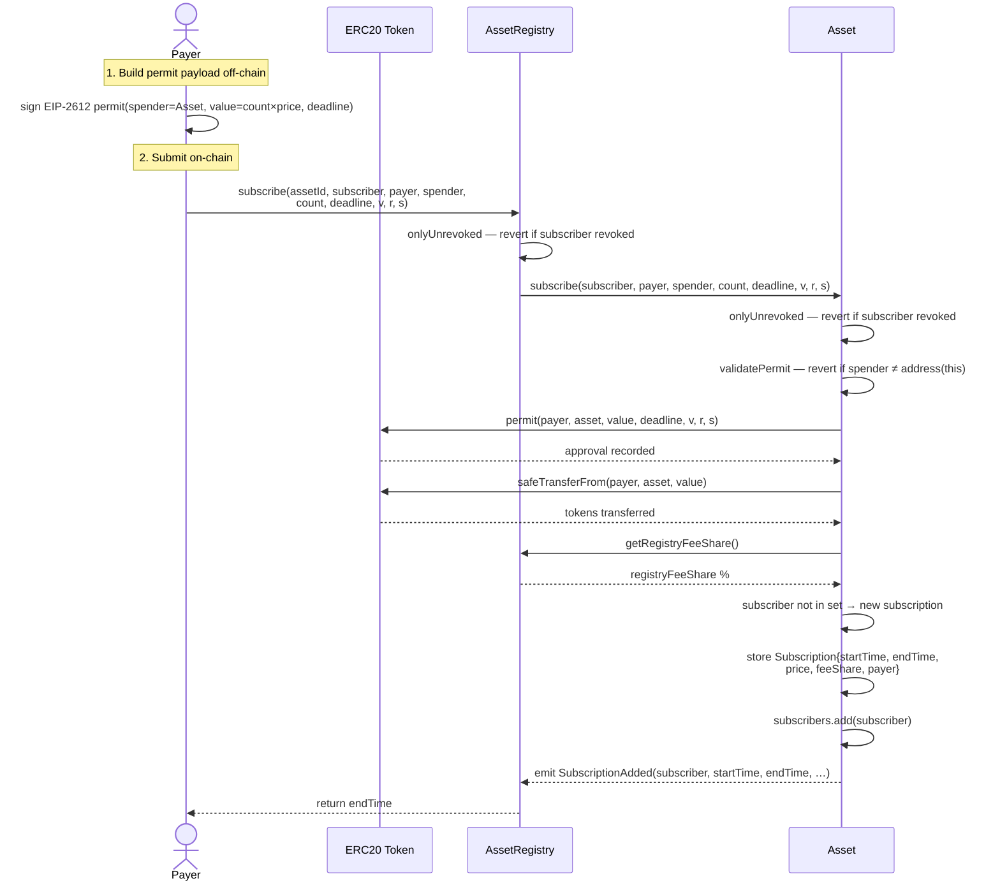

---

### Extend Existing Subscription

Triggered when the subscriber already exists **and** all conditions match: same payer, same subscription price, same registry fee share, and the current `endTime` is greater than `block.timestamp` (subscription is still active and contiguous).

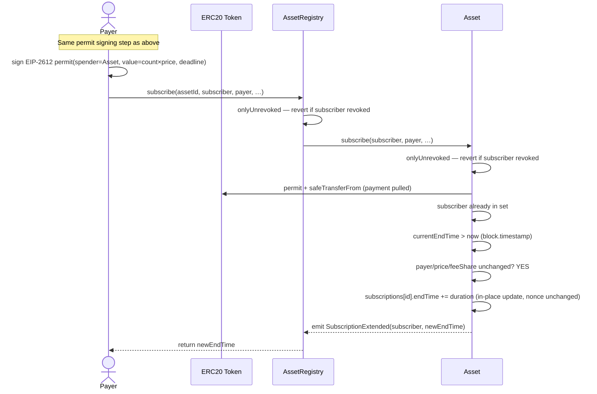

> **No nonce increment** — the existing subscription record is extended in place.

---

### Renew Subscription (New Nonce)

Triggered when the subscriber already exists but conditions differ (different payer, updated price, or updated registry fee share), or when the subscription has already expired (gap in coverage).

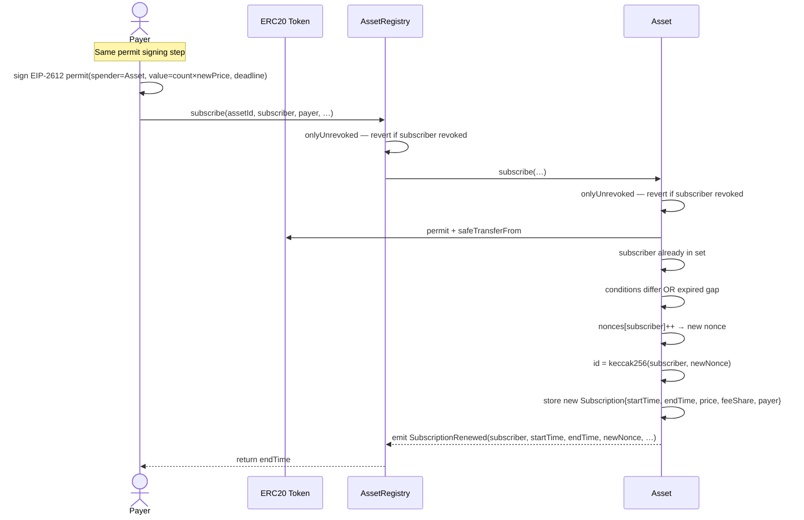

> The old subscription record remains intact under its original nonce and is used to calculate claimable fees up to the renewal point.

---

## cancelSubscription

A subscriber cancels their own subscription. Because the `subscriber` bytes32 is derived from an off-chain string identity, the caller must prove they know the pre-image by providing an **ECDSA self-signature**.

### Off-chain signature required

```
hash = keccak256(abi.encodePacked(chainId, assetAddress, subscriberBytes32))
ethSignedHash = "\x19Ethereum Signed Message:\n32" + hash
signature = sign(ethSignedHash)   ← signed by msg.sender (the subscriber address)
```

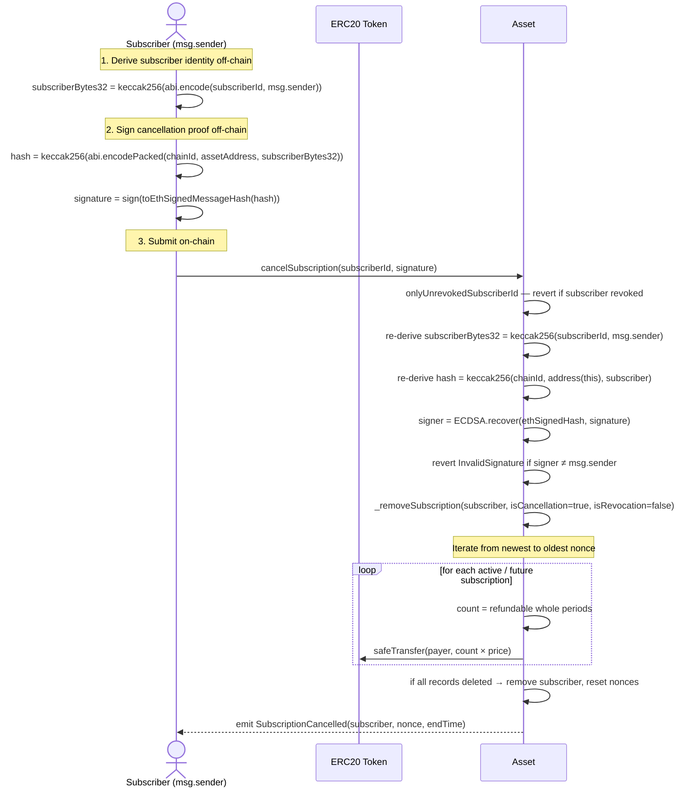

**Refund logic inside `_removeSubscription` (cancellation):**
- Future (not-yet-started) subscription records → full refund for all periods
- Active subscription → refund for all **remaining whole periods** (partial current period is non-refundable)
- Expired subscriptions → no refund; loop breaks early

---

## revokeSubscription

The **creator (asset owner)** forcibly ends a subscriber's access. Unlike cancellation, revocation refunds all remaining time including partial-period dust, and **permanently bans** the subscriber from resubscribing until the owner calls `unrevokeSubscription`.

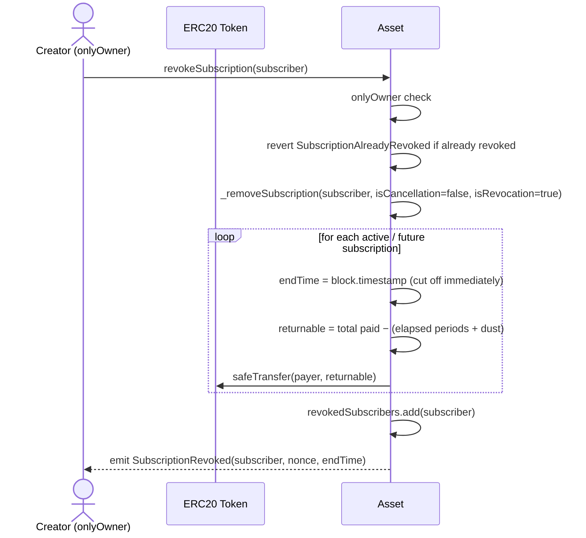

**Revocation refund logic (differs from cancellation):**
- Active subscription → the `endTime` is set to `block.timestamp`; the payer receives a full refund of unspent time, including partial-period dust (proportional to the fractional period elapsed)
- Future (not-yet-started) subscription records → full refund for all periods (same as cancellation)
- The subscriber is added to the `revokedSubscribers` set regardless; they cannot call `subscribe` or `cancelSubscription` until unrevoked

---

## unrevokeSubscription

The **creator (asset owner)** lifts a permanent revocation, allowing the subscriber to resubscribe.

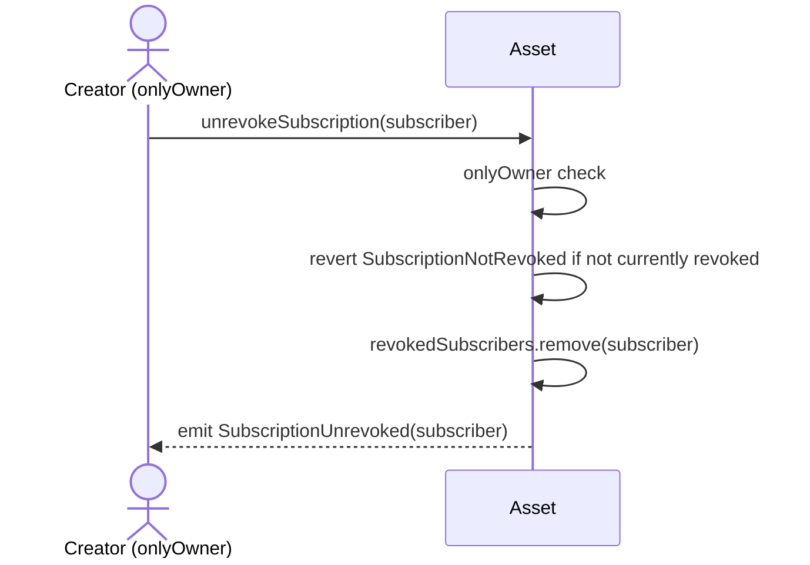

> After unrevoking, the subscriber may call `subscribe` again. Their prior subscription history (nonces, claim cursors) is preserved.

---

## claimCreatorFee — Single Subscriber

The creator pulls their accumulated share for one subscriber. The claimable amount covers all **fully completed subscription periods** since the last claim.

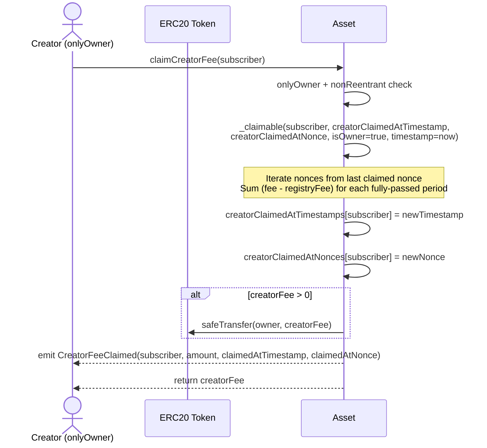

---

## claimCreatorFee — Batch

The creator claims across multiple subscribers in a single transaction.

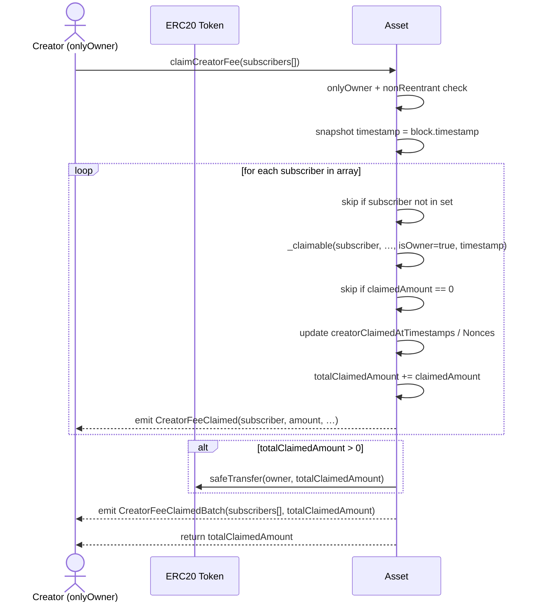

---

## claimRegistryFee

The **Registry Owner** claims the registry's share via `AssetRegistry`, which is the only caller authorised to invoke `onlyRegistry` functions on `Asset`.

### Single subscriber

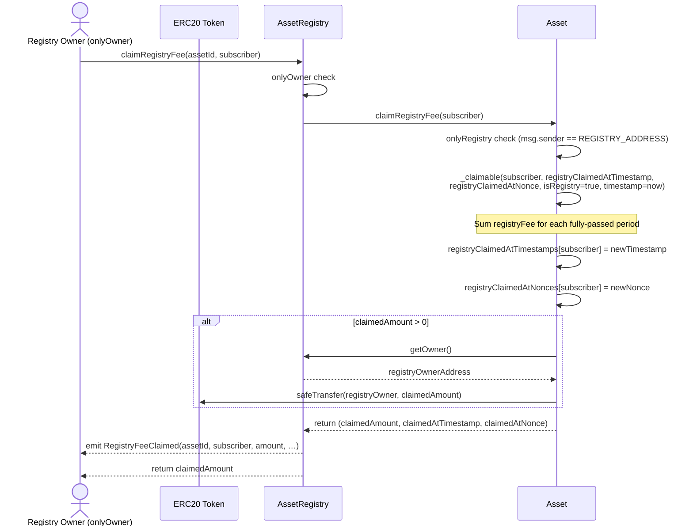

### Batch

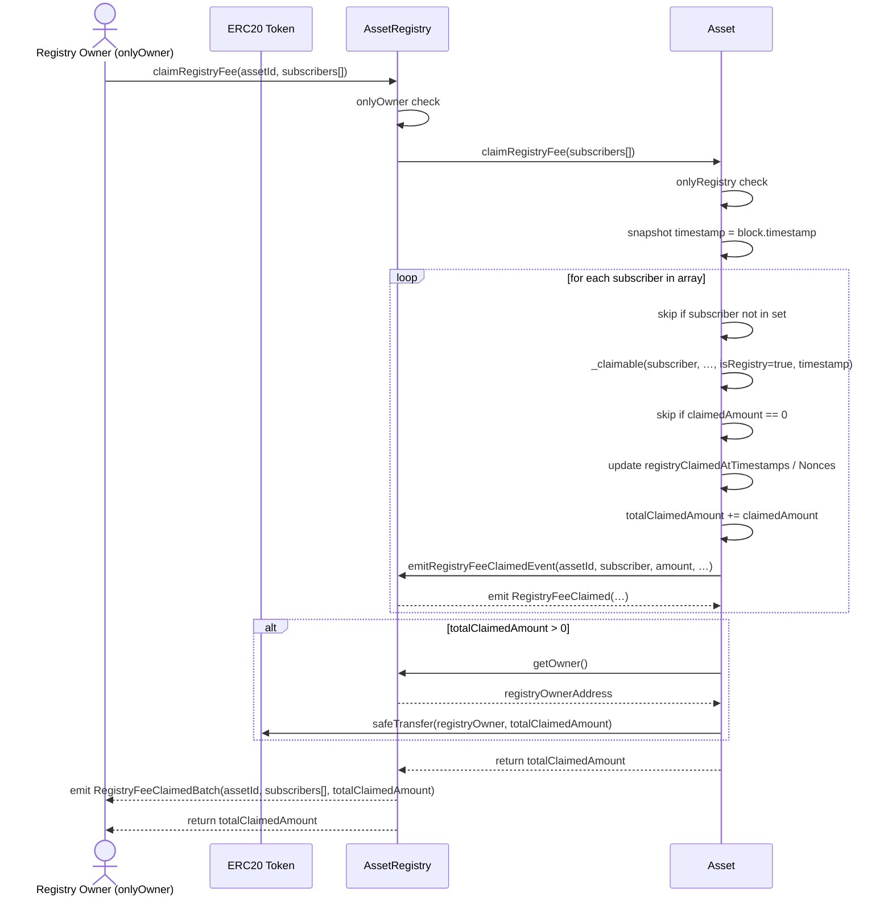

> `emitRegistryFeeClaimedEvent` is a callback from `Asset` back into `AssetRegistry`. The registry verifies `msg.sender == assets[assetId]` before emitting the event, preventing spoofed log entries.

---

## Fee Accrual & Claimability

The `_claimable` internal function is the heart of both claim flows. It never double-counts and handles nonce rollovers:

```
for nonce = lastClaimedNonce → currentNonce:
    startTime         = max(subscription.startTime, claimedAtTimestamp)
    endTime           = min(subscription.endTime,   block.timestamp)
    claimableDuration = endTime - startTime
    count             = claimableDuration / SUBSCRIPTION_DURATION   // whole periods
    fee               = count × subscription.subscriptionPrice

    // dust: partial period at the very end of a fully-elapsed subscription
    if endTime == subscription.endTime:
        dustDuration = claimableDuration - (count × SUBSCRIPTION_DURATION)
        dust         = (dustDuration × subscription.subscriptionPrice) / SUBSCRIPTION_DURATION
        fee         += dust

    claimable += (isOwner ? fee - registryFee : registryFee)
    claimedAtTimestamp = startTime + count × SUBSCRIPTION_DURATION
```

Key properties:
- **Whole-period granularity for active subscriptions** — sub-period time is not distributed while a subscription is still running
- **Dust distribution at subscription end** — once a subscription has fully elapsed (`endTime <= block.timestamp`), any partial period that was paid for but not yet distributed is included in the next claim, ensuring no tokens are permanently locked in the contract
- **Snapshot prices** — each `Subscription` record carries the price and fee share that were active at subscribe time; retroactive price changes do not affect already-paid subscriptions
- **Independent cursors** — creator and registry each maintain their own `claimedAtTimestamp`/`claimedAtNonce`, so one party claiming does not affect the other's position
